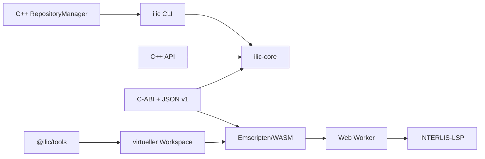

# ilic-Dokumentation

`ilic` ist ein nativer INTERLIS-Compiler ohne Java-Laufzeitabhängigkeit. Er
validiert INTERLIS 1.0, 2.3 und 2.4, erzeugt verschiedene Ausgabeformate und
kann als Kommandozeilenprogramm, C++-Bibliothek, C-ABI oder WebAssembly-Modul
eingebettet werden.

Diese Dokumentation beschreibt den aktuell implementierten Stand. Hinweise mit
**Bekannte Einschränkung** sind bewusst sichtbar und keine Beschreibung eines
erst geplanten Verhaltens.

## Schnellstart

```sh
cmake -S . -B build/macos -DCMAKE_BUILD_TYPE=Debug -DBUILD_TESTING=ON
cmake --build build/macos --parallel
build/macos/ilic -silent docs/examples/models/Legacy.ili
build/macos/ilic -silent -ilidirs docs/examples/models \
  docs/examples/models/Example.ili
```

Ein Modell direkt aus einem INTERLIS-Repository auflösen und kompilieren:

```sh
build/macos/ilic -silent \
  -repositories https://models.interlis.ch \
  -models DatasetIdx16
```

Den WASM-Compiler bauen und das geprüfte Node-Beispiel ausführen. Das Build-
Skript installiert und aktiviert die gepinnte Emscripten-Version bei Bedarf
automatisch:

```sh
./scripts/build-wasm.sh
node docs/examples/wasm-session.mjs
```

## Orientierung

| Thema                                       | Dokumentation                                                        |
| ------------------------------------------- | -------------------------------------------------------------------- |
| Unterstützte Sprachversionen und Features   | [Funktionsumfang](funktionsumfang.md)                                |
| Native und WASM-Builds                      | [Build und Installation](build-und-installation.md)                  |
| CI, Release-Train und Publikationsgrenzen   | [Build- und Publikationspipeline](build-und-publikationspipeline.md) |
| Alle Parameter von `ilic` und `ilic-format` | [CLI-Referenz](cli.md)                                               |
| Standardformatierung und Kommentarerhalt    | [Formatter](formatter.md)                                            |
| Modell-Repositories, Auflösung und Cache    | [Repositories](repositories.md)                                      |
| Fehlerpositionen und strukturierte Logs     | [Diagnostik und Logging](diagnostik-und-logging.md)                  |
| C++-API, C-ABI und JSON-Protokoll           | [Native APIs](native-api.md)                                         |
| Versionierte Syntax-/Semantik-Snapshots     | [Language-Tooling-Snapshots](language-tooling-snapshots.md)          |
| WebAssembly, Node, Browser, Worker und LSP  | [WASM](wasm.md)                                                      |
| npm-Snapshots, OIDC und Bootstrap           | [npm-Publikation](npm-publikation.md)                                |
| 571 ili2c-Referenzfälle und ihre Bedeutung  | [Compiler-Conformance](conformance.md)                               |
| Vollständige, ausführbare Programme         | [Beispiele](examples/README.md)                                      |

## Architektur



Der Compiler-Core kompiliert bereitgestellte Source-Buffers. Im nativen Binary
beschafft die C++-Repository-Library fehlende Modelle. In Browsern und Node
übernimmt `@ilic/tools` Netzwerk und Cache; danach werden alle Quellen in eine
WASM-Session kopiert. Diese Grenze hält den Compiler deterministisch und das
WASM-Modul unabhängig von einer bestimmten Host-Plattform.

## Weitere Referenzen

- Die Sprachhandbücher und Metamodelldokumente bleiben unter [`../doc`](../doc/).
- Die versionierten JSON-Schemas liegen unter [`../schemas`](../schemas/).
- Die öffentliche Conformance-Suite ist auf
  [Codeberg](https://codeberg.org/edigonzales/interlis-compiler-conformance) verfügbar.
