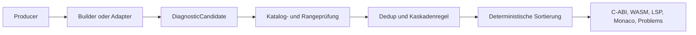

# Diagnostic Pipeline

Der Diagnosefluss ist ein strukturierter Datenfluss:



Jede öffentliche Diagnose besitzt einen registrierten stabilen `code`, eine
Severity und eine kontrollierte Meldung. `relatedInformation` verweist auf
Ursachen oder Erstdeklarationen; `phase`, `tags`, `source`, `helpId` und
`fingerprint` sind additive Metadaten.

ANTLR-Texte werden durch `ParserDiagnosticTranslator` klassifiziert. Kaskaden
werden ausschließlich über `DiagnosticCauseId` und `dependsOn` unterdrückt;
Message-Matching ist verboten. Unabhängige Diagnosen bleiben sichtbar.

Die Guards laufen mit:

```sh
node scripts/generate-diagnostic-quality-report.mjs --root . \
  --output build/diagnostic-quality.json
node scripts/check-diagnostic-architecture.mjs .
```
