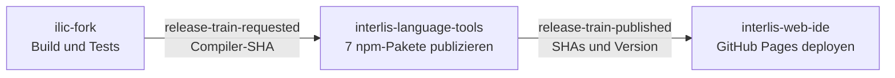

# Build- und Publikationspipeline

[Dokumentationsindex](README.md) · [Lokaler Build](build-und-installation.md) ·
[npm-Publikation](npm-publikation.md)

Dieses Repository liefert den nativen INTERLIS-Compiler sowie die beiden
npm-Pakete `@ilic/tools` und `@ilic/compiler-wasm`. Es ist der Anfang des
koordinierten Release-Trains:



Die CI dieses Repositories publiziert nicht selbst. Nach einem erfolgreichen
`main`-Build fordert sie beim Language-Tools-Repository einen Release-Train für
den exakt geprüften Compiler-Commit an. Dort werden Compiler und Language Tools
noch einmal gemeinsam gebaut, geprüft und publiziert.

## Workflows und Trigger

| Workflow | Trigger | Ergebnis |
| --- | --- | --- |
| [`.github/workflows/ci.yml`](../.github/workflows/ci.yml) | Push auf `main`, Pull Request, manuell | Native Matrix, CTest, WASM- und npm-Prüfungen; auf `main` anschliessend Release-Anforderung |
| [`.github/workflows/build-native-release.yml`](../.github/workflows/build-native-release.yml) | manuell oder `v*`-Tag | geprüfte Einzelbinary-Archive für macOS ARM64, Linux x86_64 und Windows x86_64 |
| [`.github/workflows/publish-npm-snapshot.yml`](../.github/workflows/publish-npm-snapshot.yml) | nur manuell | Compiler-only-Snapshot der beiden npm-Pakete als Bootstrap-/Recovery-Weg |

Beide Workflows checken ohne persistierte GitHub-Credentials aus. Normale
Build-Jobs besitzen nur Leserechte auf den Repository-Inhalt.

## CI: nativer Compiler und JavaScript-Pakete

Der native Matrix-Job baut und testet Linux x86_64, macOS ARM64 und Windows
x86_64. Die Runner prüfen ihre Architektur explizit. Repository-Tests verwenden
lokale Fixtures und Fake-Transporte und benötigen kein externes Repository.

### 1. Nativer Release-Build

Linux installiert die normale libcurl-Entwicklungsbibliothek und Ninja;
pugixml wird gepinnt aus Source gebaut und libxml2 ist nicht erforderlich. Der
prinzipielle Ablauf pro Plattform ist:

```sh
cmake -S . -B build/ci -G Ninja -DCMAKE_BUILD_TYPE=Release
cmake --build build/ci --parallel
ctest --test-dir build/ci --output-on-failure
```

Damit werden CLI, statische Bibliotheken und alle aktivierten Tests gebaut.
CTest prüft unter anderem Core und C-ABI, Syntax-/Semantik-Snapshots,
Formatter, Repository-Auflösung, Regressionen, Beispiele und
Dokumentationslinks. Die nativen Artefakte sind in dieser Pipeline reine
Buildartefakte; es werden weder native Pakete noch ein GitHub Release erzeugt.

### 2. Native Release-Artefakte

Der getrennte Release-Workflow baut curl HTTP(S)-only statisch. macOS ARM64
verwendet Secure Transport, Linux x86_64 einen gepinnten Alpine/musl-Container
mit statischen OpenSSL-Libraries und Windows x86_64 Schannel samt statischer
MSVC-Runtime. Nach CTest folgen plattformspezifische Runtime-Dependency-Checks,
lokale Smoke-Tests und die Archive `ilic-macos-arm64.tar.gz`,
`ilic-linux-x86_64.tar.gz` und `ilic-windows-x86_64.zip`.
Die technischen Einzelheiten des Windows-Pfads stehen unter
[Windows-Build-Stack](build-und-installation.md#windows-build-stack).

### 3. Reproduzierbarer WASM-Build

Anschliessend richtet der Job Node 22 ein, liest die Emscripten-Version aus
`.emscripten-version` und installiert genau diese Version in ein temporäres
`emsdk`. `scripts/build-wasm.sh` prüft die aktive Version erneut, baut
`ilic.mjs` und `ilic.wasm` und kopiert beide Dateien in das Quellverzeichnis von
`@ilic/compiler-wasm`.

### 4. Paket- und Consumer-Prüfung

Vor einer Release-Anforderung laufen:

```sh
npm test --prefix packages/tools
npm test --prefix packages/compiler-wasm
node --test test/npm/PrepareNpmSnapshotTest.mjs
node scripts/prepare-npm-snapshot.mjs --timestamp 20260101000000
node scripts/test-npm-packages.mjs
```

Der feste Testzeitstempel macht die Staging-Logik deterministisch. Die letzte
Prüfung erzeugt echte Tarballs, installiert sie in ein leeres temporäres
Consumer-Projekt und verwendet Compiler, Formatter und Repository-Auflösung
über die installierten Pakete. Damit wird nicht nur der Workspace, sondern die
tatsächlich auslieferbare Paketoberfläche geprüft.

## Übergabe an den koordinierten Release-Train

Nur bei einem Push auf `main` und nur nach erfolgreichem
`native-and-packages`-Job läuft `request-release-train`. Der Job sendet ein
GitHub-`repository_dispatch` mit dem Ereignis `release-train-requested` an
`edigonzales/interlis-language-tools`:

```json
{
  "compiler_sha": "<vollständiger GITHUB_SHA>",
  "compiler_ci_run_id": "<GitHub-Run-ID>"
}
```

Das Ziel-Repository baut diesen vollständigen SHA erneut. Dadurch hängt die
Publikation nicht von einem später verschobenen Branch oder npm-Dist-Tag ab.
Die Run-ID dient der Nachverfolgbarkeit der anfordernden CI; die koordinierte
Snapshot-Version verwendet die Run-ID des zentralen Publish-Workflows.

Für den Dispatch ist das Repository-Secret `RELEASE_DISPATCH_TOKEN` mit
Schreibzugriff auf `interlis-language-tools` erforderlich. Fehlt es, schlägt
nur die Übergabe nach erfolgreicher Compiler-Prüfung fehl; es wurde bis dahin
nichts publiziert.

Der zentrale Ablauf, seine sieben Pakete und der nachgelagerte Pages-Deploy
sind im
[Language-Tools-Repository](https://github.com/edigonzales/interlis-language-tools/blob/main/docs/build-und-publikationspipeline.md)
dokumentiert.

## Manueller Compiler-only-Publish

`Publish npm snapshot` ist bewusst kein normaler Release-Weg. Er publiziert
nur `@ilic/tools` und `@ilic/compiler-wasm` und stößt weder Language Tools noch
Web IDE an. Der über die GitHub-Oberfläche ausgewählte Branch oder Tag bestimmt
Checkout, Commit und npm-Provenance.

Der Job verwendet Node 24, npm 11.18.0 und die gepinnte Emscripten-Version. Die
Reihenfolge ist:

1. WASM bauen;
2. Tests beider Quellpakete und der Staging-Logik ausführen;
3. beide Snapshot-Pakete mit UTC-Zeitstempel und GitHub-Run-ID stagen;
4. gepackte und neu installierte Pakete prüfen;
5. `@ilic/tools`, danach `@ilic/compiler-wasm` mit dem Dist-Tag `snapshot`
   publizieren;
6. Commit und Versionen in die GitHub-Step-Summary schreiben.

Dieser Recovery-Workflow führt keinen nativen CMake-/CTest-Lauf aus. Vor seiner
Verwendung muss daher eine erfolgreiche CI für denselben Commit vorliegen.

Der Publish-Job erhält `id-token: write` und authentisiert sich bei npm per
OIDC Trusted Publishing. Es gibt kein dauerhaftes `NPM_TOKEN`. Bootstrap,
Trusted-Publisher-Konfiguration, Dist-Tag-Policy und die Behandlung von
Teilpublikationen stehen in [npm-Publikation](npm-publikation.md).

## Versionen und Artefakte

Die Basisversion kommt aus `CMakeLists.txt`; die Quell-Manifeste behalten diese
unveränderte Version. Ein Release-Train ergänzt denselben UTC-Zeitstempel und
dieselbe zentrale GitHub-Run-ID für beide Compiler-Pakete:

```text
0.9.9-SNAPSHOT.YYYYMMDDHHmmss.<run-id>
```

Staging-Verzeichnisse und Tarballs liegen unter `build/npm/` und werden nicht
eingecheckt. Publiziert werden nur die beiden öffentlichen npm-Pakete. Nicht
publiziert werden der native Compiler, statische Bibliotheken, CTest-Binaries,
WASM-Zwischenverzeichnisse oder ein GitHub Release.

## Lokal dieselben Gates ausführen

Mit aktivierter, zu `.emscripten-version` passender Emscripten-Umgebung:

```sh
cmake -S . -B build/local-release -G Ninja -DCMAKE_BUILD_TYPE=Release
cmake --build build/local-release --parallel
ctest --test-dir build/local-release --output-on-failure

./scripts/build-wasm.sh
npm test --prefix packages/tools
npm test --prefix packages/compiler-wasm
node --test test/npm/PrepareNpmSnapshotTest.mjs
node scripts/prepare-npm-snapshot.mjs --timestamp 20260101000000
node scripts/test-npm-packages.mjs
```

Die Installation des Emscripten SDK und plattformspezifische Build-Hinweise
sind unter [Build und Installation](build-und-installation.md) beschrieben.

## Fehlerbehandlung

- Schlägt ein Build oder Test fehl, erfolgt weder Dispatch noch Publikation.
- Schlägt der Dispatch fehl, zuerst Berechtigung und Gültigkeit von
  `RELEASE_DISPATCH_TOKEN` prüfen und danach die CI erneut starten.
- Schlägt der zentrale Release-Train fehl, wird er im
  `interlis-language-tools`-Repository untersucht; der dortige Manifest-Artefakt
  enthält beide Quell-SHAs.
- npm-Publikationen über mehrere Pakete sind nicht atomar. Ein erneuter
  zentraler Lauf überspringt bereits vorhandene identische Paketversionen; ein
  neuer Lauf erzeugt wegen Zeitstempel und Run-ID eine neue Version.
- Bereits publizierte Snapshots werden nicht überschrieben oder automatisch
  gelöscht.
