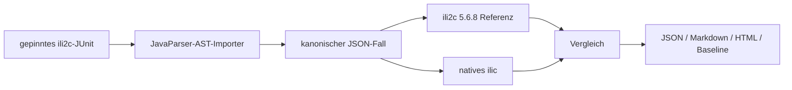

# Compiler-Conformance

[Dokumentationsindex](README.md) · [Funktionsumfang](funktionsumfang.md) · [Build](build-und-installation.md)

Die unabhängige Suite
[interlis-compiler-conformance](https://codeberg.org/edigonzales/interlis-compiler-conformance)
misst `ilic` gegen die bestehende ili2c-Testbasis. Sie ist ein separates
Repository, damit Compilerimplementierung, importierte Erwartungen und
Messartefakte nicht gegenseitig angepasst werden können.

## Warum diese Suite existiert

Ein Compiler kann syntaktisch viele Modelle akzeptieren und trotzdem
semantische Regeln übersehen. Einzelne handgeschriebene Regressionstests zeigen
nur bekannte Fehler. Die ili2c-JUnit-Suite enthält über Jahre gewachsene
Positiv- und Negativfälle für INTERLIS 2.3 und 2.4.

Die Conformance-Suite beantwortet reproduzierbar:

- Akzeptiert `ilic` ein Modell, das gemäß Test und Referenz ungültig ist?
- Lehnt `ilic` ein gültiges Modell ab?
- Stürzt der Kandidat ab oder läuft in ein Timeout?
- Stimmt eine ausdrücklich strikte Diagnostic-Erwartung?
- Hat eine Korrektur einen zuvor konformen Fall regressiert?

## Datenfluss



Der Importer übernimmt Testklasse, Testmethode, Eingabedateien,
Modellverzeichnisse, Auto-Search-Konfiguration, erwarteten Erfolg oder
Misserfolg und auslesbare Diagnostic-Erwartungen. Die Erwartung wird nicht an
das aktuelle Kandidatenverhalten angepasst.

Zuerst bestätigt das veröffentlichte ili2c 5.6.8 den kanonischen Fall. Weicht
die Referenz von der importierten Erwartung ab, wird `ilic` in diesem Fall nicht
als falsch bewertet. Erst danach erfolgt der Kandidatenvergleich.

## Korpus und aktueller Stand

Der eingefrorene Full-Korpus enthält 571 unterstützte reine Compilerfälle. Der
Korpus hat den SHA-256-Wert:

```text
5baa41c6172e169e7dd35b1241a9dc9ba6e60ab90f4918e864c90c988cc51a57
```

Der aktuelle Stand von `ilic` erreicht in diesem Korpus:

| Resultat | Anzahl |
| --- | ---: |
| konform | 571 |
| Kandidat akzeptiert ungültiges Modell | 0 |
| Kandidat verwirft gültiges Modell | 0 |
| Infrastrukturfehler | 0 |

Alle 251 enthaltenen `TRANSLATION OF`-Fälle sind konform.

## Was 571/571 bedeutet – und was nicht

Es bedeutet, dass der gemessene Compiler bei denselben gepinnten Eingaben das
erwartete Erfolgs- oder Fehlerresultat wie die bestätigte Referenz liefert.

Es beweist nicht:

- vollständige Abdeckung aller INTERLIS-Konstrukte;
- identische Diagnostic-Texte, Codes, Zeilen oder Spalten;
- Gleichheit der CLI-Optionen;
- Gleichheit der ILI-, IMD-, XSD- oder GML-Generatorausgaben;
- identisches Repository- und Cacheverhalten;
- einen fertigen LSP;
- zukünftige Konformität mit anderen ili2c- oder Korpusversionen.

Darum bleiben lokale CTests, Formatter-Korpus, Repository-Tests, ABI-Tests und
WASM-Smoke-Tests zusätzlich notwendig.

## Statuswerte

| Status | Bedeutung |
| --- | --- |
| `CONFORMANT` | Erwartung, Referenz und Kandidat stimmen überein. |
| `CANDIDATE_ACCEPTS_INVALID` | Referenz lehnt ab, Kandidat akzeptiert. |
| `CANDIDATE_REJECTS_VALID` | Referenz akzeptiert, Kandidat lehnt ab. |
| `REFERENCE_MISMATCH` | Referenz und importierte Erwartung weichen ab; Kandidat wird nicht bewertet. |
| `CANDIDATE_DIAGNOSTIC_MISMATCH` | Erfolg/Misserfolg stimmt, aber eine strikte Diagnostic-Erwartung nicht. |
| `INFRASTRUCTURE_ERROR` | Absturz, Timeout, fehlendes Binary oder Adapterfehler. |
| `IMPORT_UNSUPPORTED` | Test konnte nicht verlustfrei als kanonischer Fall dargestellt werden. |
| `SKIPPED` | Fall wurde durch Filter oder Ausführungsregeln übersprungen. |

## Vollständigen Lauf reproduzieren

Voraussetzungen:

- Java 21 oder neuer;
- Git;
- das native `ilic`-Binary und sein Checkout;
- ili2c 5.6.8;
- der gepinnte ili2c-Quellcheckout mit den JUnit-Fixtures.

```sh
export ILIC_REPO=/pfad/zu/ilic
export ILIC_EXECUTABLE=/pfad/zu/ilic/build/macos/ilic
export ILI2C_JAR=/pfad/zu/ili2c-5.6.8/ili2c.jar
export ILI2C_SOURCE_REPO=/pfad/zu/gepinntem/ili2c

cd /pfad/zu/interlis-compiler-conformance
./gradlew ciConformance
./gradlew generateConformanceBaseline
```

Ohne `ILI2C_SOURCE_REPO` bereitet `./gradlew prepareIli2cSource` den exakt
gepinnten Checkout unter `.work/upstream/ili2c` vor.

Einzelne Schritte:

```sh
./gradlew importIli2cTests
./gradlew validateGeneratedCases
./gradlew verifyReference
./gradlew runConformance
./gradlew generateConformanceReport
```

Reports enthalten eine maschinenlesbare Zusammenfassung, vollständige
Rohresultate, eine Markdown-Übersicht und einen eigenständigen HTML-Report.
Persistente Baselines werden nach Kandidaten-Commit abgelegt.

## Java-Abgrenzung

Java wird hier benötigt, weil die Suite Java-JUnit-Quellen analysiert und ili2c
als Java-Referenz startet. Das sagt nichts über die Laufzeitarchitektur von
`ilic` aus: Native CLI, C++-Core, C-ABI und WASM benötigen kein Java.
