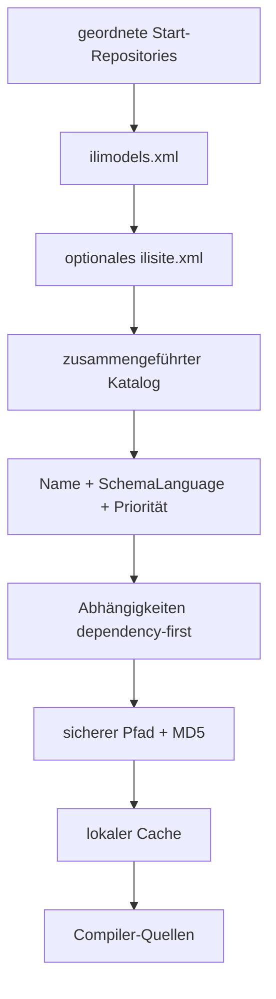

# Modell-Repositories

[Dokumentationsindex](README.md) · [CLI](cli.md) · [WASM](wasm.md)

`ilic` enthält eine native C++-Repository-Implementierung. Ein Benutzer des
Kommandozeilenprogramms muss benötigte Modelle deshalb nicht manuell suchen und
herunterladen. Für Browser und Node stellt `@ilic/tools` denselben
Beschaffungsschritt als Hostbibliothek bereit.



## Nativer CLI-Aufruf

```sh
build/macos/ilic -silent \
  -repositories https://models.interlis.ch \
  -models DatasetIdx16
```

Mehrere Repositories werden in Prioritätsreihenfolge angegeben:

```sh
build/macos/ilic -silent \
  -repositories '/srv/company-models;https://models.interlis.ch' \
  -models CompanyModel
```

Ein Repository kann ein lokaler Pfad, eine `file://`-URI oder eine HTTP(S)-URI
sein. Es muss ein `ilimodels.xml` bereitstellen. `ilisite.xml` ist optional.

```sh
build/macos/ilic -silent \
  -repositories test/repository/fixture \
  -models RepositoryRoot
```

Der letzte Befehl ist Teil der automatisierten Tests und benötigt kein
Netzwerk.

## Auflösungsalgorithmus

1. Die konfigurierten Start-Repositories werden in der angegebenen Reihenfolge
   in eine Queue gelegt.
2. Pro Repository ist `ilimodels.xml` obligatorisch. Ungültige oder nicht
   erreichbare Indizes erzeugen `ILIC-REPO-INDEX`.
3. Falls Site-Following aktiv ist, werden `parentSite` und `subsidiarySite` aus
   `ilisite.xml` angehängt. Bereits besuchte URIs werden nicht erneut geladen.
4. Gesucht wird ein exakt übereinstimmender Modellname. `browseOnly=true` wird
   ausgeschlossen; ein angegebenes `SchemaLanguage` muss exakt passen.
5. Ein Treffer aus einem früheren Repository behält Vorrang. Nur mehrere
   Versionen innerhalb desselben Repository werden verglichen; aktuell erfolgt
   dieser Vergleich lexikografisch, nicht als semantische Version.
6. `dependsOnModel` wird rekursiv aufgelöst. Abhängigkeiten stehen im Resultat
   vor dem anfordernden Modell. Das eingebaute Modell `INTERLIS` wird nicht
   heruntergeladen.
7. Ein Modellzyklus erzeugt `ILIC-REPO-CYCLE`; ein fehlendes Modell
   `ILIC-REPO-NOT-FOUND`.
8. Absolute Modellpfade und Pfade mit `..` werden als `ILIC-REPO-PATH`
   abgelehnt.
9. Dieselbe Datei wird nur einmal geladen. Ein vorhandener MD5-Wert wird vor
   Übergabe an den Compiler geprüft; Abweichungen erzeugen
   `ILIC-REPO-CHECKSUM`.

## Zusammenspiel mit `-ilidirs`

Für Imports einer explizit geladenen Datei gilt:

1. bereits geladene Modelle und Dateien derselben Session;
2. `<Modellname>.ili` in `-ilidirs`;
3. Scan anderer `.ili`-Dateien in `-ilidirs`;
4. konfiguriertes Repository.

`-no_auto` stoppt die lokale automatische Suche. Explizit als Roots geladene
Dateien bleiben verfügbar. Repository-Roots werden über `-models` beschafft.

## Nativer Cache

Der Standardpfad wird in dieser Reihenfolge bestimmt:

1. `ILIC_CACHE`, unverändert als Cacheverzeichnis;
2. `ILI_CACHE/ilic-v1` als Kompatibilitätsvariante;
3. `$HOME/.ilicache/ilic-v1`;
4. als letzter Fallback das temporäre Systemverzeichnis unter
   `ilic-cache-v1`.

```sh
ILIC_CACHE=/var/cache/ilic \
build/macos/ilic -silent \
  -repositories https://models.interlis.ch \
  -models DatasetIdx16
```

Metadaten gelten standardmäßig 24 Stunden, Modelldateien sieben Tage als
frisch. Remote-Ressourcen werden unter einem MD5 des vollständigen URI und mit
der ursprünglichen Erweiterung gespeichert. Downloads werden zuerst als
`.tmp` geschrieben und anschließend atomar umbenannt.

Wenn ein Download fehlschlägt, verwendet die Library standardmäßig einen
vorhandenen abgelaufenen Cacheeintrag und protokolliert einen Warning-Logevent.
Der CLI stellt aktuell keine Schalter für TTL, `offline` oder
`allowStaleOnError` bereit; diese Werte sind über die C++-API konfigurierbar.

## C++-API

```cpp
#include "ilic/Repository.h"

ilic::RepositoryOptions options;
options.repositories = {
   "/srv/company-models",
   "https://models.interlis.ch"
};
options.cacheDirectory = "/var/cache/ilic";
options.offline = false;
options.allowStaleOnError = true;
options.followSiteLinks = true;

ilic::RepositoryManager repositories(options);
ilic::RepositoryResult result = repositories.resolve("DatasetIdx16", "ili2_3");
if (!result.success) {
   for (const auto &diagnostic : result.diagnostics)
      std::cerr << diagnostic.code << ": " << diagnostic.message << '\n';
}
```

Für einen vollständig offline ausgeführten Lauf muss der Cache zuvor gefüllt
sein und `options.offline=true` gesetzt werden. Lokale Repository-Dateien werden
direkt gelesen und nicht in den HTTP-Cache kopiert.

## `@ilic/tools` in Node

Nach dem einmaligen [npm-Bootstrap](npm-publikation.md#einmaliger-bootstrap-auf-npm)
kann die aktuelle Vorabversion mit `npm install @ilic/tools@snapshot`
installiert werden. Der lokale Paketweg steht unter
[Build und Installation](build-und-installation.md#lokale-npm-pakete).

```js
import { RepositoryManager } from "@ilic/tools";
import { NodeFileCache } from "@ilic/tools/node";

const repositories = new RepositoryManager({
  repositories: ["https://models.interlis.ch"],
  cache: new NodeFileCache(".cache/ilic"),
  metadataTtlMs: 24 * 60 * 60 * 1000,
  modelTtlMs: 7 * 24 * 60 * 60 * 1000,
  allowStaleOnError: true,
  followSiteLinks: true
});

const workspace = await repositories.resolveModel("DatasetIdx16", "ili2_3");
console.log(workspace.models.map(model => model.metadata.name));
```

Ein ephemerer Cache ist nützlich für Tests:

```js
import { MemoryCache, RepositoryManager } from "@ilic/tools";

const repositories = new RepositoryManager({
  repositories: [fixtureDirectory],
  cache: new MemoryCache(),
  load: uri => readFile(uri),
  followSiteLinks: false
});
```

Mit `offline: true` erfolgen keine neuen Loads; fehlt ein Cacheeintrag, wird
eine Exception ausgelöst.

## Browser und IndexedDB

```js
import { RepositoryManager } from "@ilic/tools";
import { BrowserCache } from "@ilic/tools/browser";

const repositories = new RepositoryManager({
  repositories: ["https://models.interlis.ch"],
  cache: new BrowserCache("my-interlis-models")
});
const workspace = await repositories.resolveModel("DatasetIdx16", "ili2_3");
```

`BrowserCache` speichert Ressourcen und Ablagezeit in IndexedDB. Cross-Origin-
Downloads funktionieren nur, wenn das Repository passende CORS-Header liefert.

## Eigener Transport

`load(uri)` kann Authentisierung, einen Proxy oder ein anwendungsspezifisches
Dateisystem anbinden:

```js
const repositories = new RepositoryManager({
  repositories: ["https://internal.example/models"],
  load: async uri => {
    const response = await fetch(uri, {
      headers: { Authorization: `Bearer ${token}` }
    });
    if (!response.ok) throw new Error(`${response.status} ${response.statusText}`);
    return new Uint8Array(await response.arrayBuffer());
  }
});
```

Die Hostbibliothek gibt einen `ResolvedWorkspace` mit Metadaten, URI, Source und
`fromCache` zurück. Wie dieser Workspace in WASM kompiliert wird, zeigt
[`examples/wasm-repository.mjs`](examples/wasm-repository.mjs).
