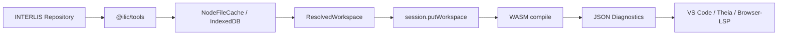

# WebAssembly, Worker und LSP

[Dokumentationsindex](README.md) · [Build](build-und-installation.md) · [Repositories](repositories.md) · [npm](npm-publikation.md)

`@ilic/compiler-wasm` bindet dieselbe C-ABI ein, die auch nativ verfügbar ist.
Compilersemantik, Formatter und JSON-Vertrag sind daher nicht in JavaScript
neu implementiert.

## Build

Für einen neuen Entwicklungsrechner zuerst das
[Emscripten SDK installieren und aktivieren](build-und-installation.md#emscripten-sdk-einmalig-installieren).
Danach genügt in jedem neuen Terminal:

```sh
source /pfad/zu/emsdk/emsdk_env.sh
./scripts/build-wasm.sh
npm test --prefix packages/compiler-wasm
```

Die Emscripten-Version ist mit `.emscripten-version` auf `3.1.64` gepinnt. Das
Resultat besteht aus `ilic.mjs` und `ilic.wasm`; der Build kopiert beide Dateien
in `packages/compiler-wasm`.

Das Paket ist für öffentliche Snapshot-Versionen vorbereitet. Nach dem
einmaligen npm-Bootstrap kann die jeweils aktuelle Vorabversion installiert
werden:

```sh
npm install @ilic/compiler-wasm@snapshot
```

Im Checkout werden die lokalen Dateien direkt importiert. Reproduzierbare
lokale Tarballs entstehen über `scripts/prepare-npm-snapshot.mjs` und
`scripts/test-npm-packages.mjs`; Details stehen unter
[npm-Publikation](npm-publikation.md).

## Erste Session

```js
import { createCompiler } from "@ilic/compiler-wasm";

const compiler = await createCompiler();
const session = compiler.createSession();
const uri = "memory:///Example.ili";

session.putSource(uri, `INTERLIS 2.3;
MODEL Example AT "https://example.invalid" VERSION "1" =
END Example.
`, 1);

const result = session.compile({ roots: [uri] });
console.log(result.success,result.diagnostics);
session.dispose();
```

`putSource` akzeptiert `string` oder `Uint8Array`. Die optionale Version wird
als Dokumentversion an den nativen SourceManager weitergegeben. Methoden nach
`dispose()` werfen einen Fehler.

Das ausführbare Beispiel ist
[`examples/wasm-session.mjs`](examples/wasm-session.mjs):

```sh
./scripts/build-wasm.sh
node docs/examples/wasm-session.mjs
```

## Formatierung

```js
const formatted = session.format(uri, {
  indentSize: 2,
  requireValidSyntax: true
});
if (formatted.success) editor.replaceDocument(formatted.text);
```

Compilation und Formatierung sind synchrone Aufrufe, nachdem das WASM-Modul
asynchron geladen wurde. Für einen UI-Thread empfiehlt sich deshalb ein Worker.

## Repository-Workspace kompilieren

Das WASM-Modul führt selbst keine HTTP-Requests aus und kennt weder Node-Dateien
noch IndexedDB. `@ilic/tools` lädt den vollständigen Workspace, danach kopiert
`putWorkspace` alle Quellen in die Session.



```js
import { RepositoryManager } from "@ilic/tools";
import { NodeFileCache } from "@ilic/tools/node";
import { createCompiler } from "@ilic/compiler-wasm";

const repositories = new RepositoryManager({
  repositories: ["https://models.interlis.ch"],
  cache: new NodeFileCache(".cache/ilic")
});
const workspace = await repositories.resolveModel("DatasetIdx16","ili2_3");
const root = workspace.models.find(model => model.metadata.name === "DatasetIdx16");

const compiler = await createCompiler();
const session = compiler.createSession();
session.putWorkspace(workspace);
const result = session.compile({ roots: [root.uri] });
session.dispose();
```

Das automatisiert geprüfte Offline-Beispiel verwendet das lokale Fixture:
[`examples/wasm-repository.mjs`](examples/wasm-repository.mjs).

## Browser

Bei einer Paketinstallation liegen `ilic.mjs` und `ilic.wasm` nebeneinander.
Der Emscripten-Loader findet das WASM relativ zum ES-Modul. Ein Bundler muss
diese Datei als Asset kopieren oder über die üblichen Emscripten-Moduloptionen
lokalisieren.

```js
import { createCompiler } from "@ilic/compiler-wasm";
import { RepositoryManager } from "@ilic/tools";
import { BrowserCache } from "@ilic/tools/browser";

const [compiler, workspace] = await Promise.all([
  createCompiler(),
  new RepositoryManager({
    repositories: ["https://models.interlis.ch"],
    cache: new BrowserCache()
  }).resolveModel("DatasetIdx16","ili2_3")
]);
```

Das Remote-Repository muss CORS für den Ursprung der Anwendung erlauben.

## Worker-Protokoll

`@ilic/compiler-wasm/worker` implementiert Request/Response-Nachrichten:

```js
// Der Build kopiert worker.js, ilic.mjs und ilic.wasm nach /assets/ilic/.
const worker = new Worker("/assets/ilic/worker.js",{ type: "module" });

let sequence = 0;
const pending = new Map();
worker.onmessage = ({ data }) => {
  const request = pending.get(data.id);
  if (!request) return;
  pending.delete(data.id);
  data.error ? request.reject(new Error(data.error)) : request.resolve(data.value);
};

function call(method,...args) {
  const id = ++sequence;
  worker.postMessage({ id, method, args });
  return new Promise((resolve,reject) => pending.set(id,{ resolve,reject }));
}

const sessionId = await call("createSession");
await call("putSource",sessionId,"memory:///Example.ili",source,1);
const result = await call("compile",sessionId,{ roots: ["memory:///Example.ili"] });
await call("disposeSession",sessionId);
```

Unterstützte Methoden sind `createSession`, `disposeSession`, `putSource`,
`removeSource`, `parse`, `compile` und `format`. Session-IDs sind UUIDs.
`worker.js`, `ilic.mjs` und `ilic.wasm` müssen im Deployment so kopiert werden,
dass der relative Import und die WASM-Lokalisierung des Workers erhalten
bleiben. Der konkrete Asset-Pfad ist eine Entscheidung des verwendeten Bundlers.

## LSP-Zielarchitektur

Ein LSP-Host sollte:

1. pro Workspace einen Worker und eine Compiler-Session führen;
2. bei `didOpen`/`didChange` den aktuellen UTF-8-Text mit Dokumentversion
   registrieren;
3. Repository-Quellen einmal auflösen und ebenfalls registrieren;
4. `compile` debouncen;
5. Diagnostics nach URI gruppieren und auf LSP-Severity abbilden;
6. bei einer harten Cancellation den Worker terminieren und den Workspace aus
   Host-Cache und offenen Dokumenten rekonstruieren.

Diagnostic-Zeilen und -Spalten sind nullbasiert. Da nicht jeder heutige
Fehlerpfad einen UTF-8-Byteoffset füllt, muss ein LSP-Host Ranges mit Unicode vor
der Fehlerstelle noch defensiv behandeln; Details stehen unter
[Positionen und Unicode](diagnostik-und-logging.md#positionen-und-unicode).

## Grenzen

- Compilation ist innerhalb eines Moduls synchron und derzeit global
  serialisiert.
- Es gibt noch keine kooperative Cancel-Funktion in der C-ABI.
- Worker-Terminierung ist die harte Abbruchgrenze.
- Repository- und Cache-Fehler entstehen im Host vor dem Compiler und müssen
  vom LSP zusätzlich zu Compiler-Diagnostics dargestellt werden.
- `@ilic/compiler-wasm` ist ein Compiler-SDK, noch kein vollständiger LSP.
